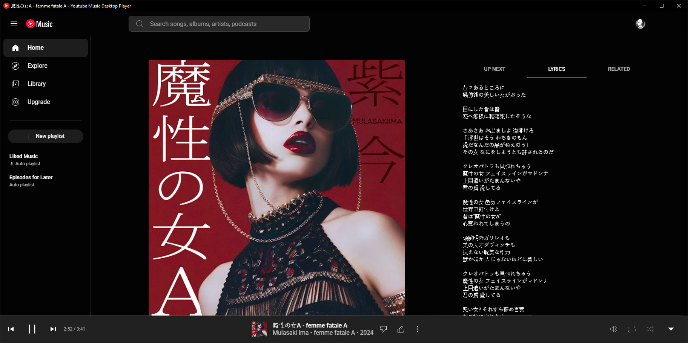

# Youtube Music Desktop Player
Turns the [YouTube Music](https://music.youtube.com) site into a cross-platform desktop application using [QtWebEngine](https://wiki.qt.io/QtWebEngine).

  

## Screenshots

## Features
- Track/playlist Downloader
- Mini-Player
- System Tray App Icon
- Windows Thumbnail Buttons
- Ad Blocker (Skipper)
- Discord Rich Presence
- Hotkey Playback Control
- Only Audio Mode
- Non-stop Music

## Get App
Just download and extract.

### Linux
  
  

---

### Windows
  

## Disclaimer
This application is unofficial and not affiliated with YouTube or Google Inc. "YouTube," "YouTube Music," and the "YouTube Logo" are registered trademarks of Google Inc. Use this application at your own risk. The author assumes no responsibility for the accounts you use to log in.
