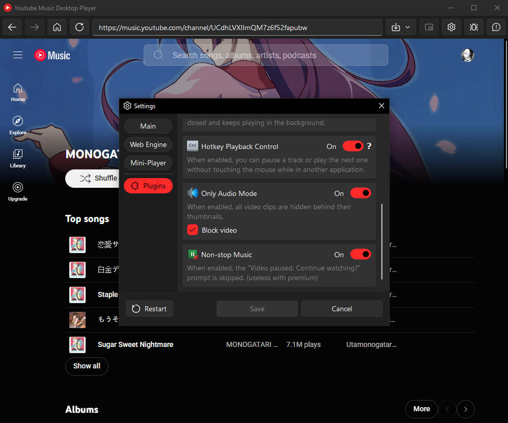
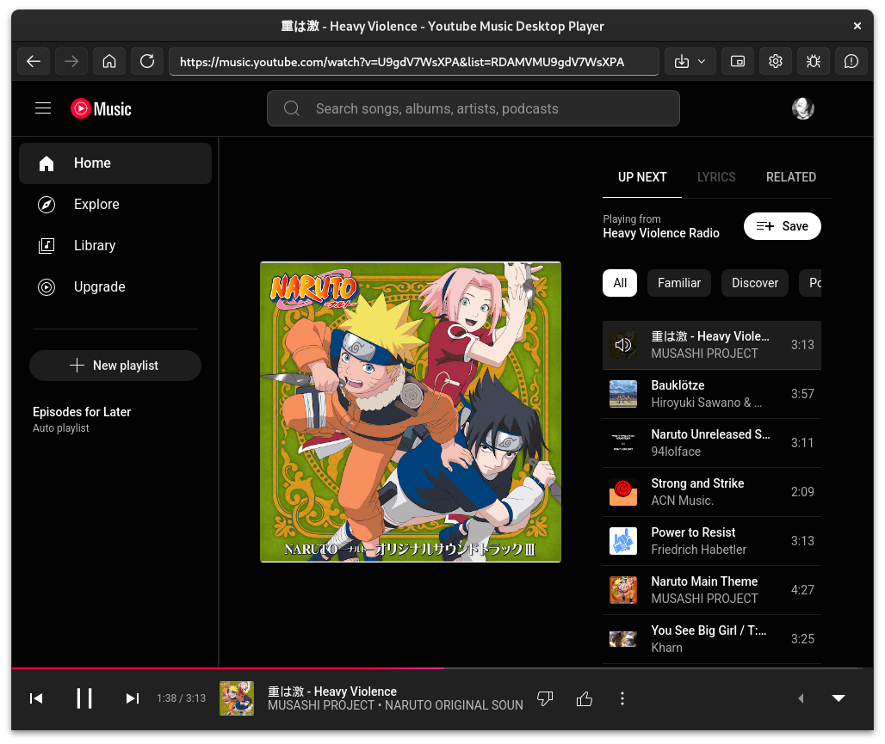

# Youtube Music Desktop Player
Turns the [YouTube Music](https://music.youtube.com) site into a cross-platform desktop application using [QtWebEngine](https://wiki.qt.io/QtWebEngine).

  

## Screenshots
<p>
  
  
</p>

## Quick Start
### Source Code
1. **Clone the Repository**  
   Clone the project repository to your local machine:
   ```bash
   git clone https://github.com/deeffest/Youtube-Music-Desktop-Player.git
   ```
2. **Navigate to the Project Directory**  
   Enter the project folder:
   ```bash
   cd Youtube-Music-Desktop-Player
   ```
3. **Install Dependencies**  
   Install the required dependencies:
   ```bash
   pip install -r requirements.txt
   ```
4. **Run the Application**  
   Start the YTMDPlayer:
   ```bash
   python YTMDPlayer.py
   ```

### Ready-to-Use Builds
1. **Download the Latest Release**  
   Get the latest version for your OS from the [Releases page](https://github.com/deeffest/Youtube-Music-Desktop-Player/releases/latest).

2. **Extract the Archive**  
   Unzip the downloaded archive to a location of your choice.

3. **Run the Application**  
   Open the extracted folder, then run the executable file to start the YTMDPlayer.

## Errors and their Fixes
### yt-dlp Error on RHEL-based Systems
> `Unable to obtain version info ([SSL: CERTIFICATE_VERIFY_FAILED] certificate verify failed: unable to get local issuer certificate (_ssl.c:1000));`

How to fix? 👇

1. **Navigate to the yt-dlp binary directory**
```bash
cd Youtube-Music-Desktop-Player/bin
```

2. **Rename the original binary yt-dlp**
```bash
mv yt-dlp yt-dlp_
```

3. **Create a shim wrapper (new yt-dlp)**
```bash
cat > yt-dlp << 'EOF'
#!/bin/bash
export SSL_CERT_FILE=/etc/pki/tls/certs/ca-bundle.crt
exec "$(dirname "$0")/yt-dlp_" "$@"
EOF
```

4. **Make the script executable**
```bash
chmod +x yt-dlp
```

## License
The Youtube Music Desktop Player is distributed under the **GPLv3 license**.

## Disclaimer
This application is unofficial and not affiliated with YouTube or Google Inc. "YouTube," "YouTube Music," and the "YouTube Logo" are registered trademarks of Google Inc. The author assumes no responsibility for the accounts you use to log in to the YouTube Music website through this application. Use this application at your own risk.

**We’d love to hear your questions or suggestions!** 💬
