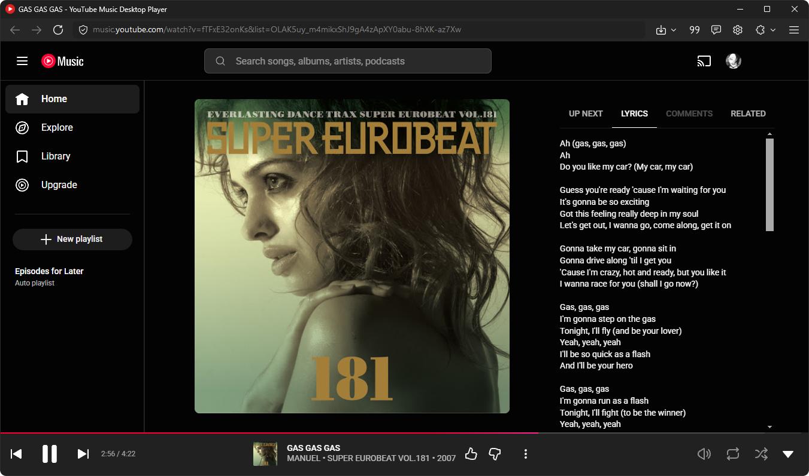

# YouTube Music Desktop Player
Turns the [YouTube Music](https://music.youtube.com) site into a cross-platform desktop application for Windows and Linux using [QtWebEngine](https://wiki.qt.io/QtWebEngine).

  

## Screenshots

## Features
- Built-in yt-dlp
- Synchronized lyrics
- View/add comments
- Music recognition
- Windows thumbnail buttons
- System tray icon
- Discord Rich Presence
- Global playback hotkeys

## Plugins
- Skip video ads
- Audio-only mode
- Non-stop music
- Hide mini player
- I'm not a kid!
- Invert to light theme
- Clean share link

or... add custom plugins! [Learn more](plugins/README.txt)

## Get app
Just download and extract ↓

### Linux
  
  

Qt5 builds (legacy)

---

### Windows
  

Qt5 builds (legacy)

## Disclaimer
This application is unofficial and not affiliated with YouTube or Google Inc. "YouTube", "YouTube Music", and the "YouTube Logo" are registered trademarks of Google Inc. Use this application at your own risk. The author assumes no responsibility for the accounts you use to log in.
