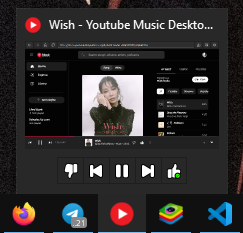

  

  <h1 align="center">
  YouTube Music Desktop Player
</h1>

  Makes the Youtube Music site a desktop app

  

  

  

English | <a href="docs/README_ru.md">Русский</a>

## ✨ Key Features

  
<strong>• Mini-Player</strong>

  
  
  
<strong>• Discord Rich Presence</strong>

  
  
  
<strong>• Windows Thumbnail Buttons</strong>

  
  
  
<strong>• System App Tray Icon</strong>

  

  
<strong>• Ad Blocker (Skipper)</strong>

  
  
<strong>• Track/Playlist Downloader</strong>

## 🚀 Quick start
<ol>
    <li>
        Clone the repository:
        <pre><code>git clone https://github.com/deeffest/Youtube-Music-Desktop-Player.git</code></pre>
    </li>
    <li>
        Navigate to the project directory:
        <pre><code>cd Youtube-Music-Desktop-Player</code></pre>
    </li>
    <li>
        Install the necessary dependencies:
        <pre><code>pip install -r requirements.txt</code></pre>
    </li>
    <li>
        Start the application:
        <pre><code>python main.py</code></pre>
    </li>
</ol>

## 🔧 Install
### Win32
#### Installer
1. Download `YTMDPlayer.exe` from [release page](https://github.com/deeffest/Youtube-Music-Desktop-Player/releases)
2. Run `YTMDPlayer.exe` as administrator and follow the steps below
3. Go to the directory with the installed application and enjoy listening:)

## 📚 See also

- [deeffest/DEEF-Lite-Media-Player](https://github.com/deeffest/DEEF-Lite-Media-Player)：A cross-platform media player designed for simplicity, lightweight performance, and broad compatibility across Windows and Linux. 
- [deeffest/DEEF-Lite-Image-Viewer](https://github.com/deeffest/DEEF-Lite-Image-Viewer)：A cross-platform image viewer designed for simplicity, lightweight performance, and broad compatibility across Windows and Linux. 
- [zhiyiYo/PyQt-Fluent-Widgets](https://github.com/zhiyiYo/PyQt-Fluent-Widgets)：A fluent design widgets library based on PyQt5

## 📜 License
The YouTube Music Desktop Player is distributed under the **GPLv3 license**.

## ⚠️ Disclaimer
This application is unofficial and not affiliated with YouTube or Google Inc. "YouTube," "YouTube Music," and the "YouTube Logo" are registered trademarks of Google Inc.

**We’d love to hear your questions or suggestions!** 💬